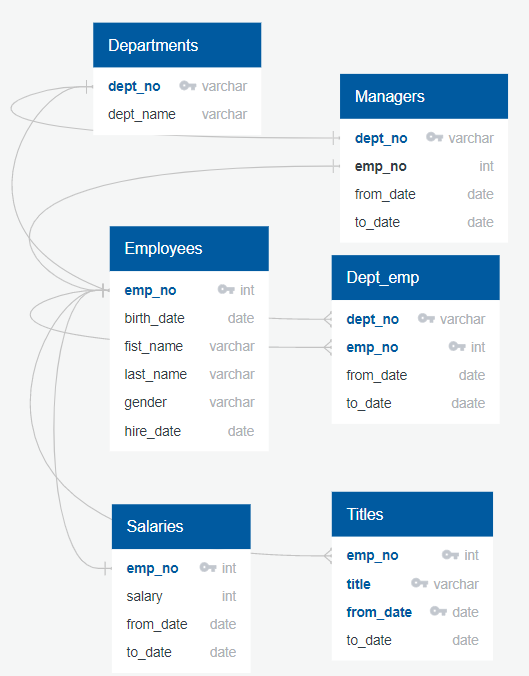
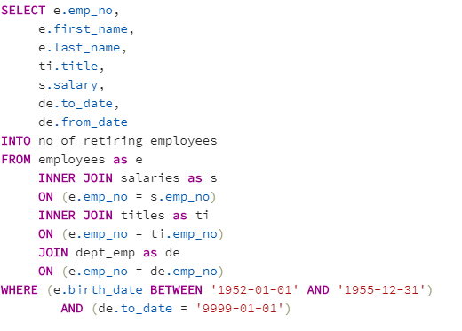
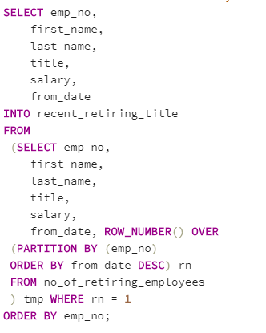
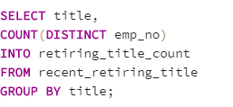
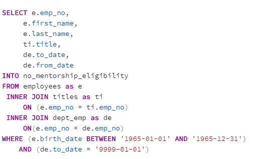
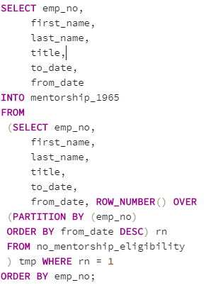
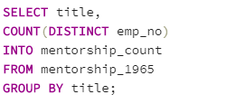

# Pewlett-Hackard-Analysis

## Project Challenge Overview

Pewlett Hackard is a large company boasting a thousand employees. The baby boomers of the company are getting ready to retire. PH is offering a retirement package for those who meet certain criteria. Also, it is looking into which position needs to be filled. HR Analyst tasked is to perform employee research to specifically answer the questions who will be retiring and how many positions need to be filled.

HR analyst manager has given two more assignments: determine the total number of employees per title who will be retiring, and identify employees who are eligible to participate in a mentorship program.

## Resouces
- Data Soucres: department.csv, dept_emp.csv, employees.csv, dept_manager.csv, salaries.csv, titles.csv
- Softward: PostgreSQL: pgAdmin4, Quick DBD

## Technical Analyis Deliverable 1:

1. For this analysis, create a table containing the number of employees who are about to retire (those born 1952-1955), grouped by job title. Using your ERD as a reference, create this table with an inner join. Your table will contain the following information:

  - Employee number
  - First and last name
  - Title
  - from_date
  - Salary

2.  Query the new table using the SELECT statement. You want to see all columns and rows, so select everything. Create a new table that includes only the most recent title of each employee

3.  Need to use the code provided below to complete the partition portion of the query. Create table.

## Technical Analyis Deliverable 2:

1.  For this table, you will need to include the following information:

  - Employee number
  - First and last name
  - Title
  - from_date and to_date

To be eligible to participate in the mentorship program, employees will need to have a date of birth that falls between January 1, 1965 and December 31, 1965. Create Table.

## Summary

The problem identified was determining how many employees will be retiring soon and what were their titles in the departments. The only data that was available was 6 CSV files. The first thing was to build an Entity Relationship Diagram (ERD) to understand the relationship between each data by finding what connects them together. The data was connected through primary keys (unique values in the main table) and foreign keys (unique values in other tables. See the ERD of Pewlett Harkard Employee below:

Once the relationship of the database was created, I added the data into a PostgresSQL database. In SQL, I created multiple tables by connecting the primary key and foreign keys to gain relevant information from the multiple tables. For the challenge, I had to create a table to create a table containing the number of employees who are about to retire (those born 1952-1955), grouped by job title. Using the ERD as a reference, I was able to create a table using the inner join method. 

 I selected the only columns I need to view from the employee's table. I used an inner join to join the four tables together. The reason I used "ON" is for SQL to find matches. The WHERE statement tells SQL to look into the birth_date column for the employees born between January 1, 1952, and December 31, 1955. I also filtered the data by "to_date=9999-01-01". The reason is that there could be employees between ‘1985-01-01’ AND ‘1988-12-31’ who could’ve left the company. So I am ensuring that the employees haven't left the company by filtering with "to_date". Once the table was created, I noticed that it appears to have duplicates. I used the partitioning method to filter out the duplicates.

Before the duplicates were removed, there was a total of 112,049 rows. After the duplicates were removed, there was a total of 72,458. I used the COUNT function to confirm the total.

For the second technical analysis deliverable, I had to determine employees who are eligible to participate in a mentorship program. The criteria to be eligible for the program were for employees who have been born between January 1, 1965, and December 31, 1965.

Removed the duplicates by the partitioning method and use the count function to find the total employees per title. See the codes below.

Before the duplicates were removed, there was a total of 2,382 rows. After the duplicates were removed, there was a total of 1,549.

In conclusion, there will be a total of 72,458 employees retiring. The largest category of employees that are retiring is the title "Engineer". There was only 2 managers identified. There are 1,549 employees eligible to participate in the mentorship program. They should start promoting lower-level employees and start hiring new employees. The mentorship will be helpful fo the new hires because it is a great way to share knowledge and train.

Review the following files:  no_of_retiring_employees.csv, recent_retiring_title.csv, and mentorship_1965.csv

